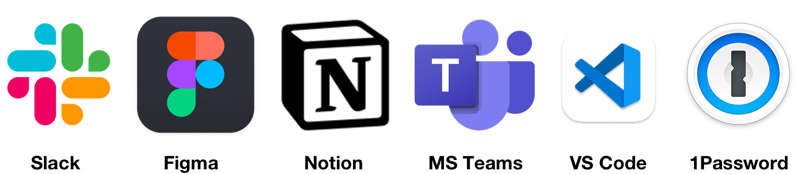

<style scoped>
h3 {
  display: block;
  font-weight: 400;
  position: absolute;
  bottom: 60px;
}
</style>

# Electron: The cross-platform desktop app framework

What's changed?
How?
Why?

### Tom Cartwright - CTO at CareScribe

---
<!-- _class: lead -->

# Act 1
A new hope

---

<style scoped>
img {
  display: block;
  position: absolute;
  bottom: 50px;
  right: 50px;
}
</style>

# What?

A framework for creating desktop apps with web technologies


---

# Why?

* Build genuinely cross-platform applications
* Deploy changes to apps without requiring user installation
* Chromium APIs in your front-end code
* Node APIs in the back-end code
* Lots of APIs provided by Electron for system integration
  - power management, storage, Tray/Menu, TouchBar 🤪

---
<style scoped>
section {
  background: #6b8794 ;
  padding: 10px;
}
</style>



---

# How?
_Show and tell time_

### Twang: The cross-platform guitar tuner

---
<!-- _class: lead -->

# Act 2
A wretched hive of scum and villainy

---

# Process model


Process model is based on Chrom(e|ium)

---


Message passing via: Inter Process Communication (IPC)

<!--
Inter process communication allows messages and data 
to be passed between isolated processes and between processes
of differing privlege levels
-->

---

# It's Node but not as we know it

- Diagrams of the processes

---

# What danger lurks within?

⚠️ Dangerous Electron example ⚠️


<!-- You can avoid this by setting nodeIntegration: true -->

---
<!-- _class: lead -->

# Act 3
Stay on target!

---

# Security upgrades

**April 2019: v5**
Changing default `nodeIntegration` setting to `false`
Content Security Policy (CSP) configuration upgrades

**March 2021: v12**
Enable `contextIsolation` by default

**August 2021: v14**
Removing `remote` module

---
# Remote module

What you used to able to do in your webContent (front-end) code:
```
const { systemPreferences } = require('electron').remote
systemPreferences.getMediaAccessStatus('microphone')
```

---

**August 2022: v20**
Sandboxing enabled by default

---

# Use the safety net: Preload

🔐 Configure the app securely

📞 Load a script defining the API your FE code can use to access the the main process

➡ Dive into the _Twang_ code for examples

<!-- Refer the Twang example here with the mic permissions -->

---

# Operating with the OS

🖥 Electron APIs for OS specific functions

🍴 Forking other processes

---

# Performance

---


---

# Alternatives

- Tauri
- Wails
- neutralino.js
- Flutter

---

# Things I would have like to talked more about

- Profiling
- Organising code for true cross-platform apps: web, desktop, mobile 

---
