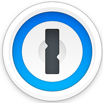

<style scoped>
h3 {
  display: block;
  font-weight: 400;
  position: absolute;
  bottom: 60px;
}
img {
  padding-top: 0px;
  padding-right: 32px;
  display: block;
  float: left;
}
h2 {
  margin-top: 64px;
}
</style>

#  Electron
## A cross-platform desktop app framework

What's changed?
How?
Why?

### Tom Cartwright - CTO at CareScribe

---
<!-- _class: lead -->

# Act 1
A new hope

<!-- Electron 
July 2013:
Atom Shell
2015 changed name to electron
💥
-->

---

<style scoped>
  img {
    display: block;
    bottom: 50px;
    margin: auto;
  }
</style>

# What?

A framework for creating desktop apps with web technologies


---

<style scoped>
  ul {
    list-style: none;
  }
</style>
# Why?

* 👷🏽‍♂️ Build genuinely cross-platform applications
* 📮 Deploy changes to apps without requiring user installation
* 🤖 Chromium APIs in your front-end code
* 🍴Node APIs in the back-end code
* 🧳 Lots of APIs provided by Electron for system integration
  - ▸ power management, storage, Tray/Menu, TouchBar (🤪)

---
<style scoped>
section {
  padding: 120px;
}
ul {
  font-size: 56px;
  list-style: none;
}
li img {
  display: block;
  padding-top: 8px;
  padding-right: 24px;
  float: left;
}
</style>

-  Slack
-  Figma
-  Notion
-  MS Teams
-  1Password

---

# How? Show and tell


_Tunapp_ - the cross-platform guitar tuner

---
<!-- _class: lead -->

# Act 2
A wretched hive of scum and villainy

---

# Process model


Process model is based on Chrom(e|ium)

---


Message passing via: Inter Process Communication (IPC)

<!--
Inter process communication allows messages and data 
to be passed between isolated processes and between processes
of differing privlege levels

STRUCTURED CLONE ALGORITHM
-->

---

# It's Node 
(but not as we node it)

* NodeJS but with a different Application Binary Interface (ABI)
* ASAR (tar-like archive format with indexing) support

---


# What danger lurks within?

⚠️ Dangerous Electron example: With audience participation ⚠️

📥 https://t.ly/KsWO

➡️ https://library-of-secrets.herokuapp.com/

```bash
$ echo "SOMETHING SECRET" >> ~/very-secret
$ cat ~/very-secret
> "SOMETHING SECRET"
```


<!-- You can avoid this by setting nodeIntegration: true -->

---
<!-- _class: lead -->

# Act 3
Stay on target!

---

# Security upgrades

* **2017** Figma create `BrowserView` for safely embedding content

```javascript
// In the main process.
const { app, BrowserView, BrowserWindow } = require('electron')

app.whenReady().then(() => {
  const win = new BrowserWindow({ width: 800, height: 600 })

  const view = new BrowserView()
  win.setBrowserView(view)
  view.setBounds({ x: 0, y: 0, width: 300, height: 300 })
  view.webContents.loadURL('https://electronjs.org')
})
```

---

* **2019: v5**
Changing default `nodeIntegration` setting to `false`
Content Security Policy (CSP) configuration upgrades

* **2021: v12 - 14**
Enable `contextIsolation` by default
Removing `remote` module

<!-- 
contextIsolation: ensures that both your preload scripts and Electron's internal logic run in a separate context to the website you load in a webContents. 
-->

---
# Remote module

What you used to able to do in your webContent (front-end) code:
```javascript
const { systemPreferences } = require('electron').remote
systemPreferences.getMediaAccessStatus('microphone')
```

---

**2022: v20**
Sandboxing enabled by default


<!-- 
The sandbox limits the harm that malicious code can cause by limiting access to most system resources — sandboxed processes can only freely use CPU cycles and memory. In order to perform operations requiring additional privilege, sandboxed processes use dedicated communication channels to delegate tasks to more privileged processes.
-->
---

<style scoped>
  li {
    margin-left: -40px;
    list-style-type: none;
  }
</style>

# Use the safety net: Preload

* 🔐  Configure the app securely

* 📞  Define an API for _renderer_ ↔️ _main_

* ➡  Dive into the _Tunapp_ code for examples

<!-- Refer the Tunapp example here with the mic permissions -->

---

<style scoped>
  li {
    margin-left: -40px;
    list-style-type: none;
  }
</style>

# Operating with the OS

* 🖥 Electron APIs for OS specific functions

* 🍴 Forking other processes

* 💪🏼 NodeJS workers

* 🔌 Dubious uses for WebSockets?


<!-- Show example of setting up a menu for an app 

shoe electron api docs https://www.electronjs.org/docs/latest/api/app-->

---
# Building, distribution, and updating

Four steps

1. Compile from your source
2. Bundle up with Electron
3. Create an installer
4. Handling auto-updates

<!-- show example of unbundling an asar 

-->

---

# "Meta" bundling libraries

Electron Forge or Electron Builder

* Both can help you with the 4 tasks
* Both make use of some of the sub-packages that deal with specific aspects (e.g. electron-packager)

---

# Performance

---


---

<style scoped>
section {
  background: #e8e1cb;
  color: #455a64;
}
ul {
  font-size: 56px;
  list-style: none;
}
</style>
# Alternatives

- 
- 
-  neutralino.js
- 

---


---
# Things I would have like to talked more about

- Profiling
- Organising code for true cross-platform apps: web, desktop, mobile
- WASM

---
<!-- _class: lead -->

# Thank you for listening

@tomcartwrightuk
github.com/tomcartwrightuk
carescribe.io
